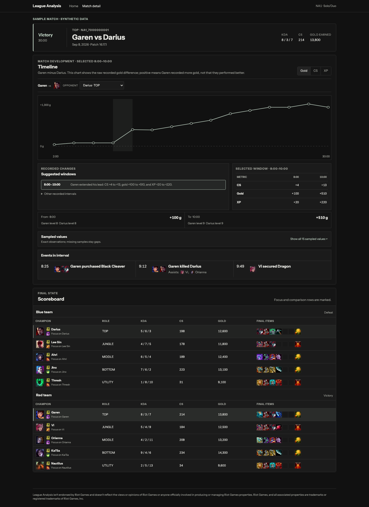

# match-analysis-v1

A League of Legends match-history app for exploring how a match developed. Open a match, compare two champions, and follow recorded CS, gold and XP differences alongside purchases and events.

[Open the hosted pre-release prototype](https://league-match-analysis.vercel.app). It supports real NA1 ranked Solo/Duo lookup and the independently labeled invented sample. Hosting for testing and Riot review does not imply Riot approval.

The included sample is invented data stored in PostgreSQL. From **8:00 to 10:00**, Garen’s difference against Darius changes from **+4 to +13 CS**, **+100 to +510 gold**, and **+20 to +220 XP**. The page shows the before/after values, a Black Cleaver purchase at 8:25, Garen’s kill on Darius at 9:12 with recorded assists from Vi and Orianna, and Vi’s dragon event at 9:49. Nearby events provide context; they do not establish what caused a change.



*Local production screenshot using the normal optional game-asset catalog. All match and participant data in this sample is synthetic.*

## Run locally

Requirements: Docker with Compose for the production package. Source development also requires Java 21 JDK, Node.js 24 (see `.node-version`), npm and Git. The Maven wrapper is included.

From the repository root, create ignored configuration and start the production package:

```bash
test -e .env || cp .env.example .env
docker compose --project-name league-analysis-app --file compose.app.yaml --env-file .env up --detach --build --wait
```

Keep `RIOT_API_KEY` blank and `RIOT_PUBLIC_LOOKUP_ENABLED=false` for sample-only use. The example password is for local development. Ordinary startup applies database migrations but does not seed a match. Run the explicit seed:

```bash
docker compose --project-name league-analysis-app --file compose.app.yaml --env-file .env run --rm --no-deps backend --spring.main.web-application-type=none --seed-demo
```

Open [localhost:3416](http://127.0.0.1:3416) and select **Explore sample match**. Choose another interval and refresh: the selection remains in the URL. The seed is idempotent and refuses to replace unrelated data at its reserved match ID. PostgreSQL persists the sample across restarts in its named volume.

For source development:

```bash
./scripts/setup
./scripts/dev app
# In a second terminal, after the database is ready:
./scripts/seed-demo
```

Open [localhost:3000](http://127.0.0.1:3000). Setup creates missing `.env` and `frontend/.env.local` without replacing existing values, installs locked frontend dependencies and Playwright Chromium. Keep ports 3000 and 8080 available; set `POSTGRES_PORT` in `.env` if 5432 is occupied. The backend local profile reads the root `.env`; the frontend reads the server-only `BACKEND_URL` from `frontend/.env.local`.

[Deployment and runtime configuration](docs/deployment.md) covers private service boundaries, environment variables, seeding and container verification.

## Scope and limitations

Live Riot ID lookup supports **NA1 / AMERICAS, ranked Solo/Duo (queue 420), latest five matches**. The hosted release is an unpromoted pre-release prototype for testing and Riot review. Product registration and production approval are separate from hosting this prototype; no Riot approval is claimed. Local configuration disables live lookup by default and the sample works without a Riot key. See the [registration package](docs/prototype-registration.md).

The match page provides final team results, a ten-player scoreboard with names and current queue-specific ranks, a unified opponent selector, an area chart, suggested windows, other recorded intervals, and timestamped events. Final results remain separate from the selected interval. Blue means victory and red means defeat regardless of map side. Sampled values and events expand into contained scrollable tables. It defaults to the unique same-role opponent when available. Positive differences describe recorded quantities; they do not prove better play. Missing or conflicting samples remain gaps. No interpolation supplies exact state at a kill, and the app makes no causal coaching or replay claims.

Suggestions use a small deterministic heuristic: for each gold-bearing sample, consider the first gold-bearing endpoint 2–3 minutes later; require an absolute change in gold difference of at least 300; rank by that change, select up to three nonoverlapping windows, and display them chronologically. Adjacent comparable samples remain selectable even without a suggestion. Summary text reports the endpoint differences. This is a browsing aid, not a general interpretation model.

Riot keys, PUUIDs and captured provider response bodies remain server-side. PostgreSQL retains captured payloads, retrieval/ingestion records and normalized match data; re-ingestion replaces current normalized rows while preserving capture history. No scheduled data-cleanup policy is implemented. Optional patch-matched Data Dragon images fall back to text/IDs when unavailable. Live ingestion currently supports one persistent backend instance; see [lookup behavior and limits](docs/public-match-lookup.md).

## Architecture and verification

The request path is browser → Next.js server → Spring Boot → PostgreSQL. Java performs Riot ingestion, normalization and deterministic calculations; React/TypeScript renders validated responses and keeps comparison/interval state in the URL. [Architecture](docs/architecture.md) explains these boundaries and retained analysis routes. [Developer/API guide](docs/developer-guide.md) covers local ingestion, legacy analysis and focused checks.

```bash
./scripts/verify full
./scripts/package-smoke
python3 scripts/tests/export_policy_test.py
```

Local release verification passed 327 backend tests, 253 frontend tests, 19 browser behavior tests and 11 pinned visual checks, plus lint, typecheck, production builds and the publication allowlist check. The production package was exercised on arm64 with service authentication enabled, a clean database, explicit seed and restart persistence. [The initial GitHub release CI](https://github.com/liamkinnally/league-match-analysis/actions/runs/34543239413) also passed, including its amd64 container build.

Hosted verification covered real lookup, five-match history, the reviewed match and another victory, URL state, keyboard metric switching, opponent selection, tooltips, contained event/sample disclosures, policies and desktop/narrow layouts. The backend rejects absent or invalid service credentials, PostgreSQL has no public ingress, and scans of served pages, loaded JavaScript and release source found none of the actual runtime credentials. A daily private backup was restored into an isolated PostgreSQL 17 database and reproduced the real match results. Seven backup behavior tests passed. See [deployment status and operational limits](docs/deployment.md#verified-release-status). No traffic-scale or usage-cost claims have been measured.

## Riot attribution

match-analysis-v1 isn't endorsed by Riot Games and doesn't reflect the views or opinions of Riot Games or anyone officially involved in producing or managing Riot Games properties. Riot Games, and all associated properties are trademarks or registered trademarks of Riot Games, Inc.
