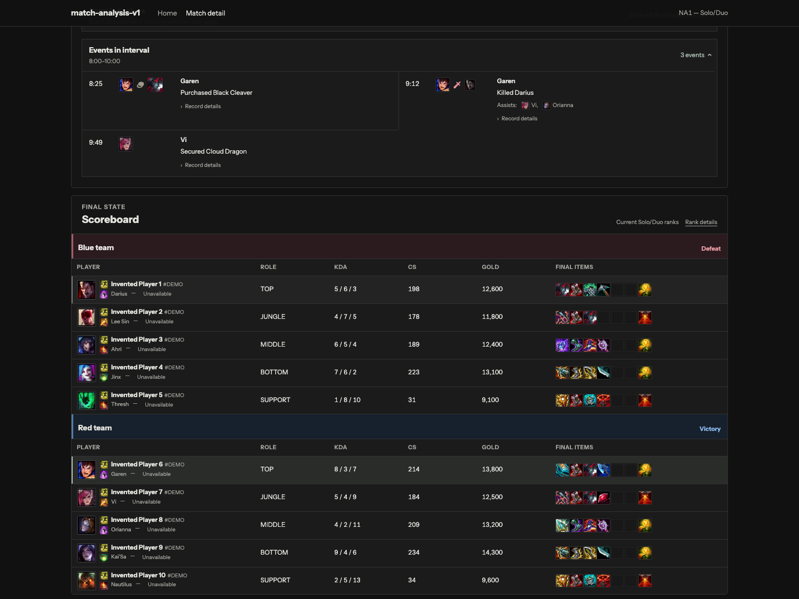

# LoL Match Analysis

A League of Legends match-history and timeline application built with Java, Spring Boot, Next.js, TypeScript and PostgreSQL. Look up a player, open a recent match, and compare how two champions' gold, CS and experience changed over time alongside recorded events.

[Open the site](https://lolmatchanalysis.app) · [Architecture](docs/architecture.md) · [Development guide](docs/developer-guide.md)

Live lookup is subject to Riot API availability and request limits. The included synthetic match can be explored without a Riot API key.

## Match review

- Look up an NA1 player across Summoner’s Rift and ARAM queues, filter by Queue Type, and load older history in pages of up to twenty matches.
- Review team results, objectives, builds, KDA, CS, gold and current queue-specific ranks when available.
- Compare gold, CS or XP differences over time with player, opponent and interval selections preserved in the URL.
- Inspect timestamped kills, objectives, item changes and ward events alongside sampled values.


*The screenshots use the built-in synthetic match. Missing source fields are shown as unavailable.*

<details>
<summary>Events and scoreboard</summary>



</details>

## Architecture

```text
Browser -> Next.js -> Spring Boot -> PostgreSQL
                         |
                         v
                    Riot Games API
```

| Layer | Responsibilities |
| --- | --- |
| Next.js 16, React 19, TypeScript | Server-rendered pages, URL state, API proxying and interactive match views |
| Recharts, Tailwind CSS | Timeline chart and interface styling |
| Java 21, Spring Boot 4, JDBC, Flyway | Riot ingestion, normalization, match calculations and schema migrations |
| PostgreSQL 17 | Lookup runs, player identities, normalized match data and source captures |
| Vercel and Railway | Frontend hosting, backend hosting, PostgreSQL and scheduled backups |

The browser talks to Next.js, and server-side requests authenticate to the Spring backend with a separate service token. Riot keys and database credentials stay on the server. Provider responses are stored separately from normalized match records so calculations can be traced back to their source. See [architecture](docs/architecture.md) for more detail.

## Run locally

The packaged app needs Docker with Compose and Git:

```sh
git clone https://github.com/liamkinnally/league-match-analysis.git
cd league-match-analysis
test -e .env || cp .env.example .env
docker compose --project-name league-analysis-app --file compose.app.yaml --env-file .env up --detach --build --wait
docker compose --project-name league-analysis-app --file compose.app.yaml --env-file .env run --rm --no-deps backend --spring.main.web-application-type=none --seed-demo
```

Open [localhost:3416](http://127.0.0.1:3416) and choose **Explore sample match**. Keep `RIOT_API_KEY` blank and `RIOT_PUBLIC_LOOKUP_ENABLED=false` to use only the synthetic sample.

For source development, install Java 21 and Node.js 24 in addition to Docker:

```sh
./scripts/setup
./scripts/dev app
# In a second terminal after PostgreSQL is ready:
./scripts/seed-demo
```

Open [localhost:3000](http://127.0.0.1:3000). See the [development guide](docs/developer-guide.md) for focused test commands and local ingestion.

## Tests

```sh
./scripts/verify full
./scripts/package-smoke
```

CI runs backend tests, frontend lint/type checks and tests, production builds, browser behavior tests, visual regression tests and a packaged-container smoke test.

## Limits and data handling

- Live lookup supports NA1 / AMERICAS Summoner’s Rift queues with pages of up to twenty matches, explicit refresh cooldowns, and timelines loaded when a match is opened. Arena and other regions remain unsupported.
- Current ranks are current queue-specific snapshots, not historical ranks or MMR.
- Timeline samples describe recorded points in time rather than continuous game state. Missing source data remains unavailable instead of being inferred.
- Suggested intervals highlight recorded changes in gold difference; they do not claim why a change happened.
- Raw source captures and normalized match data are stored separately. The project includes a private operator workflow for removing a player's stored data and reconciling backups.

[Privacy Policy](https://lolmatchanalysis.app/privacy) · [Terms](https://lolmatchanalysis.app/terms) · [Third-party notices](THIRD_PARTY_NOTICES.md)

## Riot notice

LoL Match Analysis isn't endorsed by Riot Games and doesn't reflect the views or opinions of Riot Games or anyone officially involved in producing or managing Riot Games properties. Riot Games, and all associated properties are trademarks or registered trademarks of Riot Games, Inc.
